Best-practices
- disable password authentication
- use SSH keys for connection
- secure physical access


# Authentication

- Files Username and Passwords
- Files Username and Tokens
- Certificates
- External Authentication providers LDAP
- Service Accounts


## Users with access

- Admins 
- Developers 
- Application End Users - managed by applications
- Bots - ServiceAccount

- k8s does not manage user lists, but uses an external user management like LDAP
- k8s manages ServiceAcounts

User access - managed by kube-apiserver
- static pwd file - insecure
- static token file - insecure
- certificates
- identity services

## Static pwd file

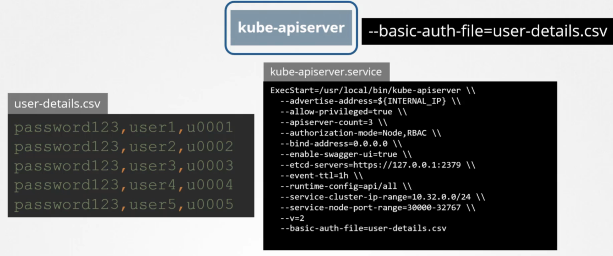

```
curl-V-k https://master-node-ip:6443/api/v1/pods -u "user1: password123"
```

## Static token file

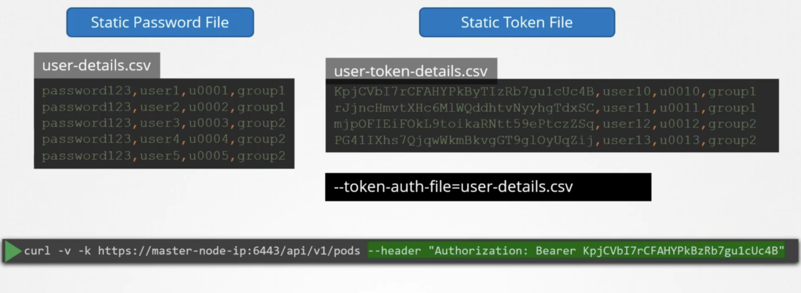

- consider volume mounts for kubeadm setup if using files


## KubeConfig

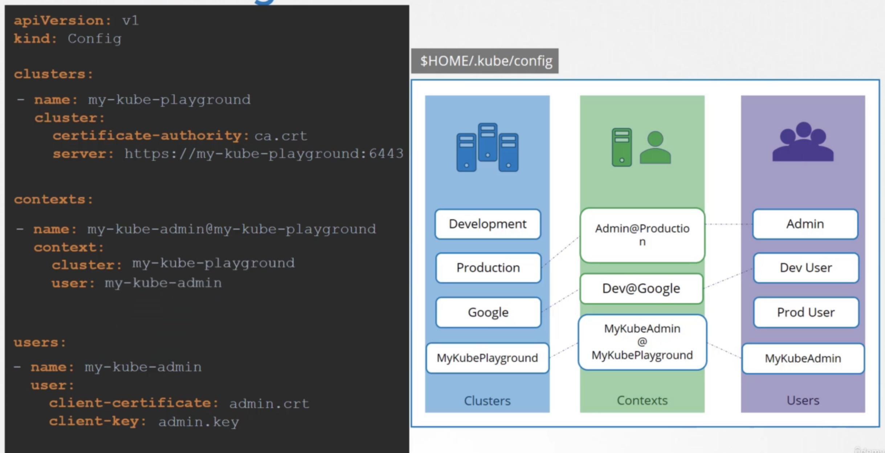


current-context: ...
default - .kube/config

```
k config view
k config set-context --current --namespace=...
```


# Authorization

- RBAC Authorization
- ABAC Authorization
- Node Authorization
- Webhook Mode

Autorization Modes

- AlwaysAllow 
- NODE 
- ABAC 
- RBAC 
- WEBHOOK 
- AlwaysDeny
 

TLS Certificates
- communication between components

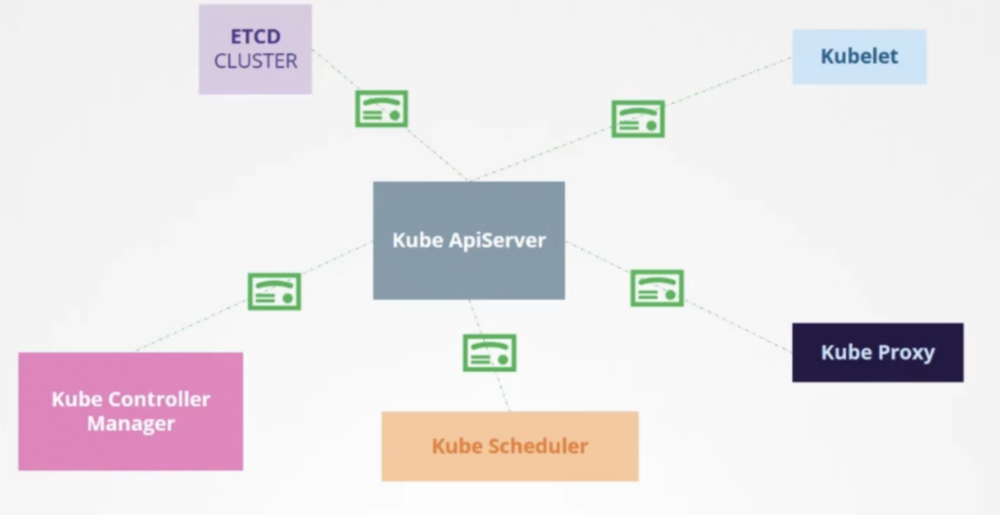


Communication between pods is open by default, but can be restricted with NetworkPolicy


## ABAC

Attribute Based Access Control

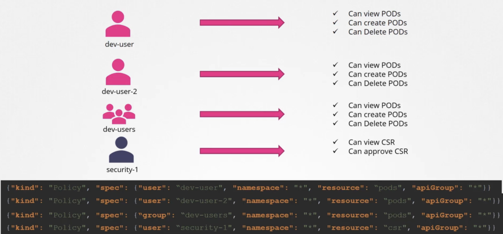

- very tedious to maintain
- directly associating a user or group with a set of permissions
- requires restart of the kube-apiserver

## Webhook

- send request to 3rd party application which decides permissions


Listed when deploying the API server and evaluated one after the other until access is granted


## RBAC

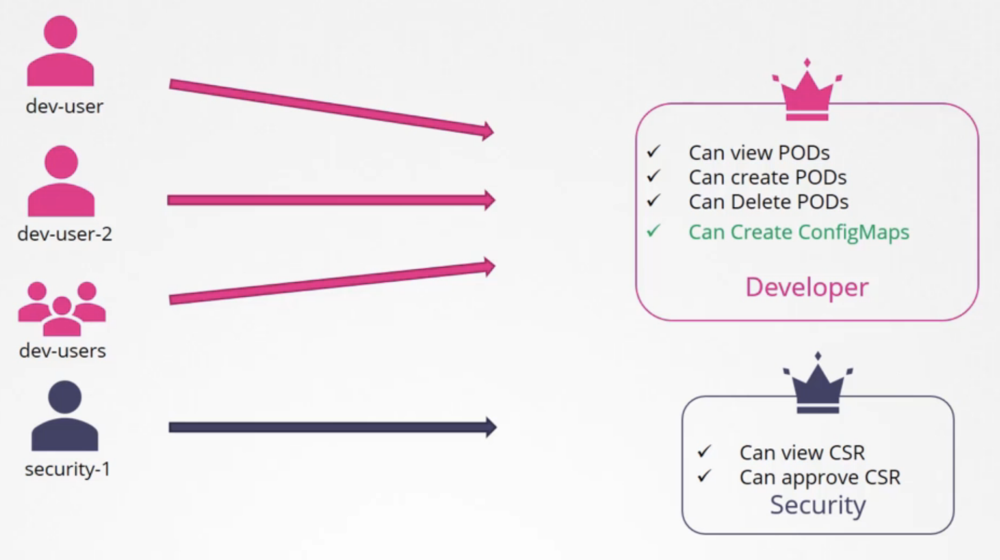

- changing the roles automatically reflects

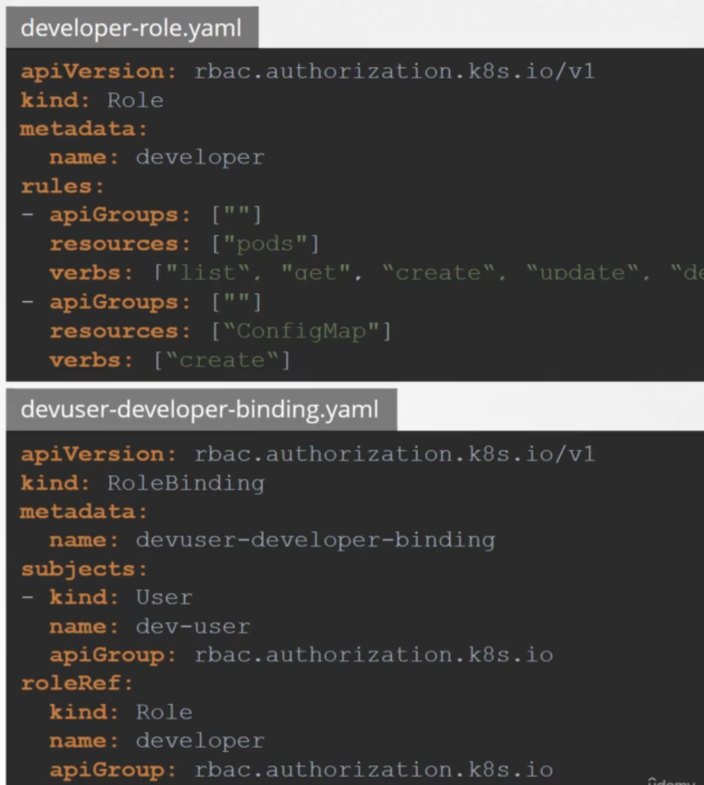

apiGroup is "" for core resources

Check access
```
k auth can-i create deployments --as dev-user
```

Roles
```
apiVersion: rbac.authorization.k8s.io/vl
kind: Role
metadata:
  name: developer
rules:
- apiGroups: [""]
  resources: ["pods"]
  verbs: ["get", "create", "update"]
  resourceNames: ["blue", "orange"]
```

- roles are namespace bound

### ClusterRoles

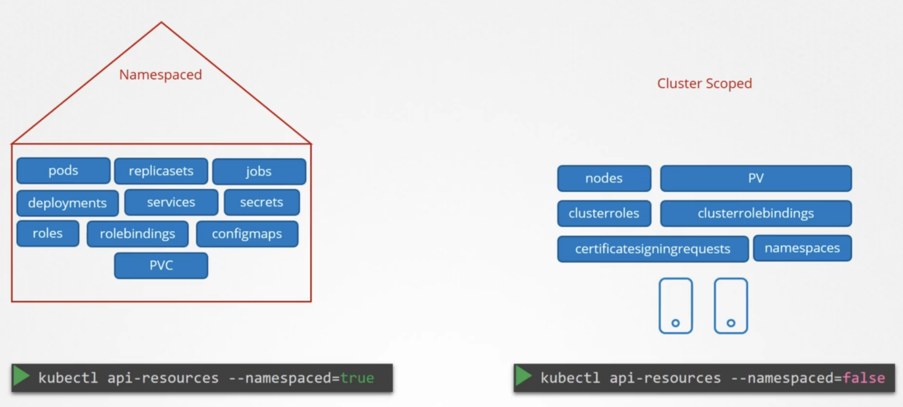


- roles for cluster scoped resources
- if you create a Cluster Role for namespaced resources, the user that has the role will have access to these resources across namespaces

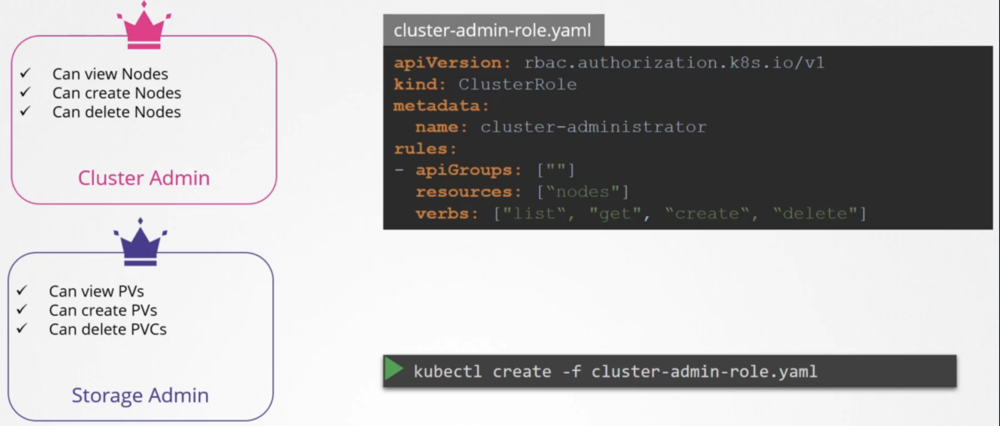


Check kube-api server pod
```
kubectl describe pod kube-apiserver-controlplane -n kube-system
```

```
kubectl create role foo --verb=get,list,watch --resource=pods,pods/status
k create role --verb=list,create,delete --resource=pods developer
```


## Admission Controllers
- provides more restrictions that are not achievable by RBAC
- restrict images, registry, tags (not latest)
- restrict to not use root user
- sits after authentication and authorization and validates configuration


Get default enabled admission controllers
```
kubectl exec kube-apiserver-controlplane -n kube-system -- kube-apiserver -h | grep enableadmission-plugins
```


### Validating Admission Controller

- NamespaceExists, NamespaceLifecycle
- validate resource requests


### Mutating Admission Controller

- mutates certain objects before their creation
- they change the request
- DefaultStorageClass - adds storage class default to pvc if not specified
- evaluated first before validating admission controller so that any changes can be made first before validated


### Admission Webhook Server

- sends requests to admission webhook controllers
- they send allowed or not
- the server can be any kind of code and needs to have functions for /validate and /mutate
- it needs to perform the logic and return a response to the webhook

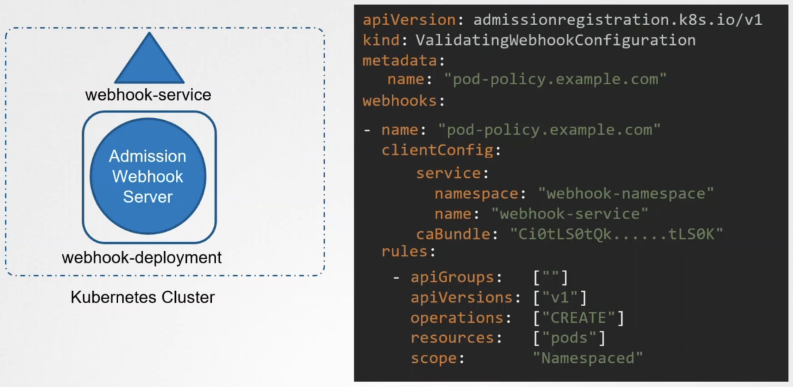

- clientConfig - specify which service to call
- rules - specify in which case to call the Admission Webhook Server


# ApiGroups

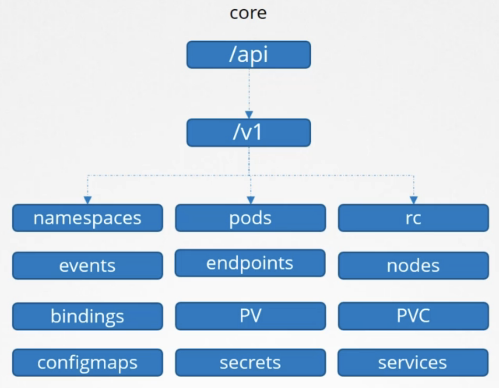

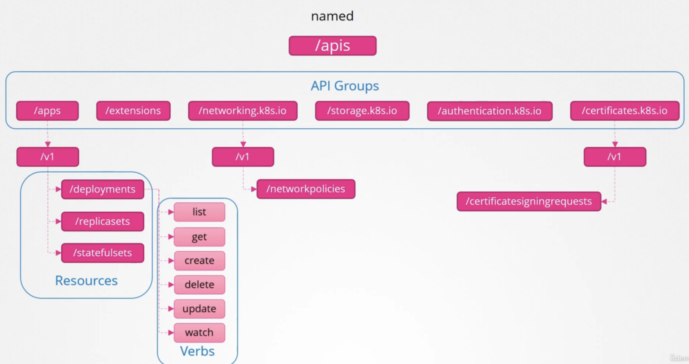

Make cluster available at localhost:8001
http proxy service
```
k proxy 
```

# API Versions

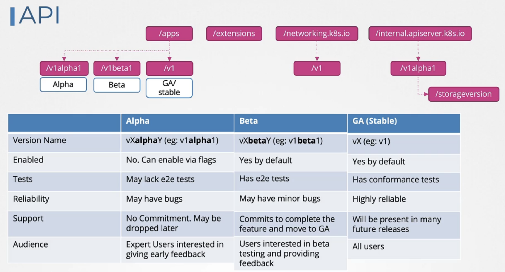

```
k api-resources # get api resources in k8s
k explain mutatingwebhookconfigurations # explain api resource
```

preferred version
- storage version
- stored in etcd
- mutated from non preferred
storage version
- version in which it is stored in etcd

alpha
- need to be added via a flag

Add to api server config and restart it
```
--runtime-config=batch/v2alpha1'
```


## Deprecations

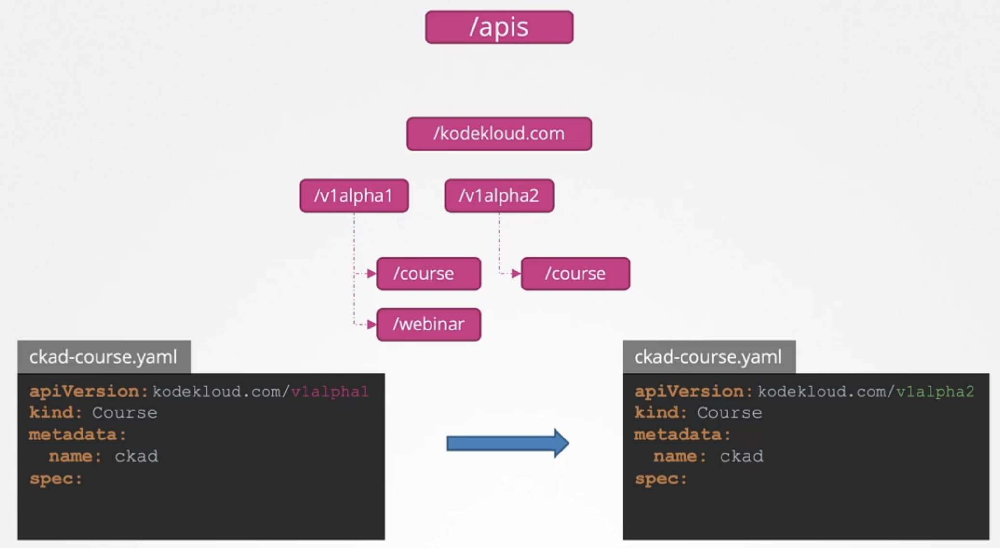

Rule 1: api versions can only be removed by incrementing the version of the api group

- v1alpha2 may be the preferred api version so that course objects created with v1alpha1 will be mutated to v1alpha2
- webinar will still use the old version
- can have more than one alpha or beta version

Rule 2: API objects must be able to round-trip between API versions in a given release without information loss, with the exception of whole REST resources that do not exist in some versions.

Rule 4a: Other than the most recent API versions in each track, older API versions must be supported after their announced deprecation for a duration of no less than:
- GA: 12 months or 3 releases (whichever is longer)
- Beta: 9 months or 3 releases (whichever is longer)
- Alpha: 0 releases

If an alpha api version is removed you will need to change the apiVersion in your files

Rule 4b: The "preferred" API version and the "storage version" for a given group may advance until after a release has been made that supports both the new version and the previous version

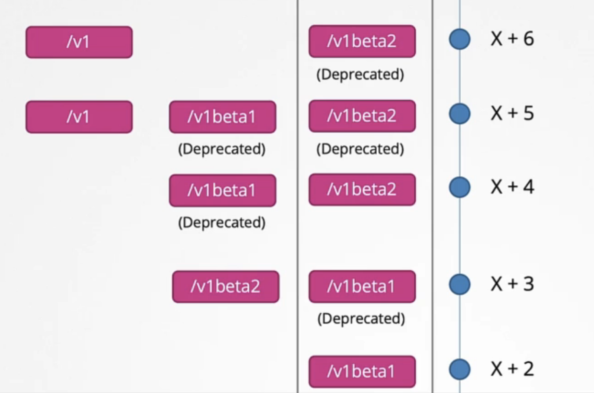

Rule 3: An API version in a given track may not be deprecated until a new API version at least as stable is released.
- v1 may not be deprecated for v2alpha1
- GA may deprecate alpha or beta versions but not the other way around

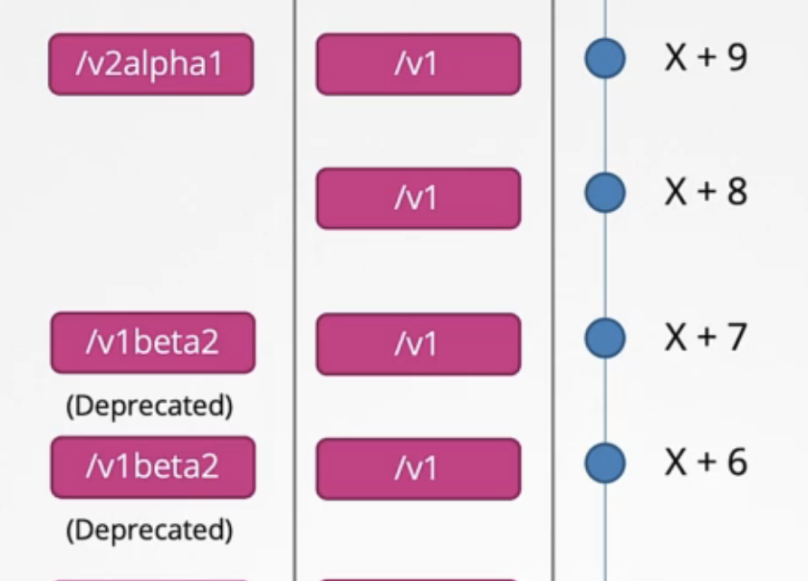

Kubectl Convert
- convert yaml files to newer versions
- separate plugin that needs to be installed

```
k convert -f file.yaml --output-version=<new-version>
```
