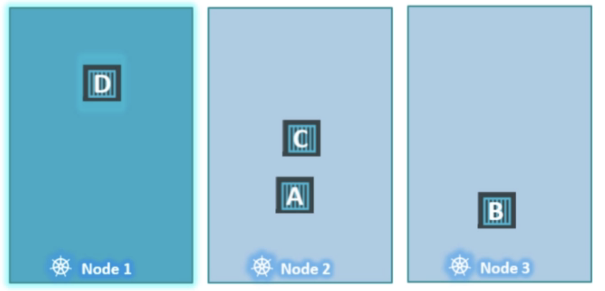
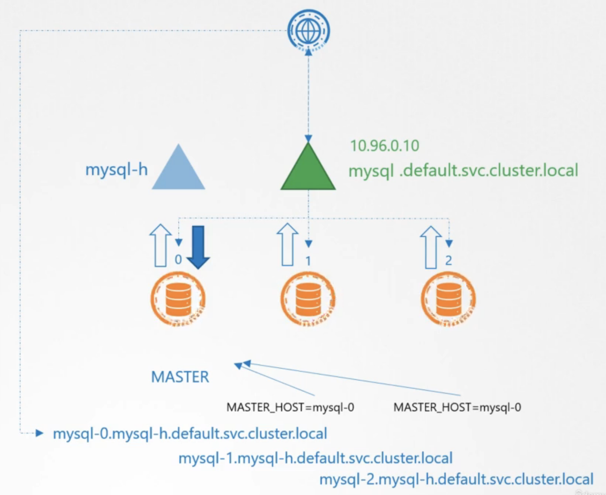

# ReplicationController


# ReplicaSet

- has a selector and that is one of the major difference with RC
- Selector 
	- can match pods created by the template and existing pods that have specific labels
	- if skipped it assumes the labels in the pod template
- when you make a change to RS you need to delete the pods for it to take effect


Change number of replicas
```
kubectl scale --replicas=6 -f file.yaml
k scale --replicas=6 rs myrs1
```


# Deployments

Same definition as RS

## Output 
1. -o json Output a JSON formatted API object.
2. -o name Print only the resource name and nothing else.
3. -o wide Output in the plain-text format with any additional information.
4. -o yaml Output a YAML formatted API object.


## Rollout status
```
kubectl rollout status deployment/myapp-deployment
```

## Revisions
```
kubectl rollout history deployment/myapp-deployment
```

Check specific revision
```
kubectl rollout history deployment nginx --revision=1
```

Record change - updates the CHANGE-CAUSE field when listing history
```
kubectl edit deployments nginx --record
```

## Rollback
```
kubectl rollout undo deployment/myapp-deployment
```

## Deployment strategy
- RollingUpdate - default
	- old RS scaled down by one, new one scaled up by one and so on
- Recreate
	- old RS scaled down to 0, new one scaled up to the max
- Other is not directly supported
	- Blue Green
		- both deployed at the same time
		- blue has all the traffic
		- once green is ready switch traffic to green altogether
		- 
		- service uses selectors to select which deployment to route to so switch that when the green deployment is ready
	- Canary
		- send most of the traffic to the base version
		- send part of the traffic (~20%) to a canary pod or deployment
		- if all works fine do a rolling update on the original deployment
		- delete the canary pod
		- 
		- depends on number of pods, if you want to do percentage based routing or other use service mesh


# Namespaces

Change context ns
```
kubectl config set-context --current --namespace=dev
```

Resource Quota for ns


# Service Account

```
apiVersion: v1
kind: Pod
metadata:
  name: my-kubernetes-dashboard
spec:
  containers:
    - name: my-kubernetes-dashboard
      image: my-kubernetes-dashboard
      serviceAccountName: dashboard-sa
```

K8s automatically mounts the default SA


To stop automounting 
```
automountServiceAccountToken: false
```


# Pods

## Commands and arguments


Edit specifications of a pod that are not editable
```
k edit po podname
# A copy of the file with your changes is saved in a temporary location as shown above.
k delete po podname
k apply -f /tmp/file.yaml
```

2nd option
```
kubectl get pod webapp -o yaml > my-new-pod.yaml
vi my-new-pod.yaml
k delete po webapp
k apply -f my-new-pod.yaml
```

Editing deployment is straightforward as it creates a new pod


## Env vars

```
env:
  - name: APP COLOR
    value: pink
  - name: APP COLOR
    valueFrom:
      configMapKeyRef:
        name: cm-name
        key: cm-key
  - name: APP COLOR
    valueFrom:
      secretKeyRef:
        name: secret-name
        key: secret-key

envFrom:
  - configMapRef:
      name: myconfigmap
```


## ConfigMaps

```
kubectl create configmap app-config --from-literal=APP_COLOR=blue \
  --from-literal=APP_MOD=prod
kubectl create configmap \
  app-config --from-file=app_config.properties
```

Env vars from cm


## Secrets

Imperative
```
kubectl create secret generic mysecret --from-literal=APP_COLOR=blue \
  --from-literal=APP_MOD=prod
kubectl create secret generic \
  mysecret --from-file=app_config.properties
```

Declarative
```
apiVersion: v1
kind: Secret
metadata:
  name: app-secret
data:
  DB Host: mysql
  DB User: root
  DB Password: paswrd
```

Encoding
```
echo -n "mysql" | base64
echo -n "bXlzcWW=" | base64 --decode
```


## Security Context

Docker runs containers in their own namespace - they see their own file path and their own processes
Root user on the host and on the container are not the same
Capabilities are limited in the container


```
docker run --user 1000 --cap-add=MAC_ADMIN nginx
```

Security Contexts can be set on the pod or container level. The container level overrides the pod level
```
apiVersion: v1
kind: Pod
metadata:
  name: web-pod
spec:
  securityContext:
    runAsUser: 2000
  containers:
  - name: ubuntu
    image: ubuntu
    command: ["sleep", "3600"]
    securityContext:
      runAsUser: 1000
      capabilities:
        add: ["MAC_ADMIN"]
```

## Resource Requirements

### ResourceRequests

- default: 0.5 CPU and 256 Mi - set by LimitRange resource
- lowest is 1m
- 100m = 0.1

Memory
- 1 G (Gigabyte) = 1,000,000,000 bytes
- 1 M (Megabyte) = 1,000,000 bytes
- 1 K (Kilobyte) = 1,000 bytes
- 1 Gi (Gibibyte) = 1,073,741,824 bytes
- 1 Mi (Mebibyte) = 1,048,576 bytes
- 1 Ki (Kibibyte) = 1,024 bytes

### ResourceLimits

Scheduling is done based on requests not limits.
```
resources:
  requests:
    memory: "1Gi"
    cpu: 1
  limits:
    memory: "2Gi"
    cpu: 2
```

Exceeding limits
- CPU - container is throttled and it cannot use more than the limit
- MEM - container can use more MEM than the limit. If a pod does it constantly, it will be terminated.

OOMKilled - means that pod consumed more memory than its limit


## Taints and tolerations

Only pods with a specific toleration can be placed on a tainted node
- Taints added to nodes
- Tolerations added to pods




```
apiVersion:
kind: Pod
metadata:
  name myapp-pod
spec:
  containers:
  - name: nginx-container
    image: nginx
    tolerations:
    - key: "app"
      operator: "Equal"
      value: "blue"
      effect: "NoSchedule"
```

Taint effects
- NoSchedule - does not schedule any new pods without the necessary tolerations
- PreferNoSchedule - tries to not schedule pods without the necessary tolerations
- NoExecute - kills existing pods that don't have the necessary tolerations

Taints and tolerations say where a pod can and cannot be scheduled. It does not mean the pod will be scheduled on a specific node.
If you want to restrict a pod to certain nodes, use node affinity.

Master node is tainted to not allow pods to be scheduled


## Node Selector

You need to label the node and then add nodeSelector to the pod
```
apiVersion:
kind: Pod
metadata:
  name myapp-pod
spec:
  containers:
  - name: data-processor
    image: data-processor
    nodeSelector:
      size: Large
```

```
k label nodes nodename key=value
```

Limitations
- cannot choose one of 2 nodes (OR)
- cannot restrict to not be on a specific node label (NOT)

Operators - In, NotIn, Exists

NodeAffinity types
- requiredDuringSchedulingIgnoredDuringExecution
- preferredDuringSchedulingIgnoredDuringExecution - try your best but still schedule it for sure
- requiredDuringSchedulingRequiredDuringExecution - evict pods that do not have the NodeAffinity necessary (planned)

```
kubectl describe node node01 | grep -i taints
```


## Multi-container pods

- adapter
	- process logs before sending them
- ambassador
	- facilitate connection to a db for example when there are different envs
- sidecar - logging container

The pods share 
- network space
- lifecycle
- access the same persistence


## Readiness probe

- Readiness probe is set on container level
- traffic is sent only to Ready containers
- if a container crashes the readiness probe makes it not ready

Pods have status and conditions
Status
- Pending - has not been scheduled anywhere yet
- ContainerCreating - images are pulled and the container starts
- Running - once all containers have started

Conditions - true or false conditions
- PodScheduled
- Initialized
- ContainersReady
- Ready


types
- httpGet
- tcpSocker - for checking if db is available
- exec
additional options
- initialDelaySeconds
- periodSeconds - seconds between attempts
- failureThreshold - default 3


## Liveness probe

- periodically test if the container is healthy - if unhealthy destroy it
- good for checking if a website has frozen and is still serving new traffic


Metrics

Metrics Server - needs to be installed
```
k top node
k top pod
```


## Labels and Selectors

- used to group resources

## Annotations

- used for recording properties and values


# Role Binding

```
kind: RoleBinding
apiVersion: rbac.authorization.k8s.io/v1
metadata:
  name: read-pods
  namespace: default
subjects:
- kind: ServiceAccount
  name: dashboard-sa # Name is case sensitive
  namespace: default
roleRef:
  kind: Role #this must be Role or ClusterRole
  name: pod-reader # this must match the name of the Role or ClusterRole you wish to bind to
  apiGroup: rbac.authorization.k8s.io
```


# Role

```
# pod reader
kind: Role
apiVersion: rbac.authorization.k8s.io/v1
metadata:
  namespace: default
  name: pod-reader
rules:
- apiGroups:
  - ''
  resources:
  - pods
  verbs:
  - get
  - watch
  - list
```


# Jobs

Pods are used to run workloads continuously and they try to recreate failed containers.

The property restartPolicy: Always is for Pods 
restartPolicy
- Always
- Never
- OnFailure

Jobs are for performing tasks successfully to completion
Pods in jobs should not be restarted unless they failed
```
apiVersion: batch/v1
kind: Job
metadata:
  name : math-add-job
spec:
  completions: 3
  parallelism: 3
  template:
    spec:
      containers
      - name: math-add
        image: ubuntu
        command: ['expr', '2+2' ]
      restartPolicy: Never
```


# CronJob

```
apiVersion: batch/v1betal
kind: CronJob
metadata:
  name: reporting-cron-job
spec:
  schedule: "*/1 * * * *"
  jobTemplate:
    spec:
      completions: 3
      parallelism: 3
      template:
        spec:
          containers:
          - name: reporting-tool
            image: reporting-tool
          restartPolicy: Never
```


# StatefulSet

- created sequentially
- pods have numbered names that are not random
- wait for first pod to be ready before the second one is spun up
- good for master slave apps
- ordered graceful deployment
- stable unique network identifier

```
apiVersion: apps/v1
kind: StatefulSet
metadata:
  name: mysql
labels:
  app: mysql
spec:
  template:
    metadata:
      labels:
        app: mysql
    spec:
    - containers:
      name mysql
      image: mysql
  replicas: 3
  selector:
    matchLabels:
      app: mysql
  serviceName: mysql-h
```

podManagementPolicy - if you wish to deploy in parallel (set to parallel)


##  Headless Service





```
apiVersion: apps/v1
kind: StatefulSet
metadata:
  name: mysql-deployment
labels:
  app: mysql
spec:
  serviceName: mysql-h
  replicas: 3
  matchLabels:
    app: mysql
  template:
    metadata:
      name: myapp-pod
      labels:
        app: mysql
      spec:
      - containers:
        name: mysql
        image: mysql
```

- provides a dns entry for each pod (pod-name.svc-name.namespace.cluster.local)
- subdomain needs to reference the name of the service
- hostname is required for the pod dns entry
- when using statefulsets you can specify the serviceName for the headless service


##  Storage

- in STS pods can share a PVC or have different PVC per pod
- to share it include it in the pod template as a volume
- to use different PVCs you need to include volumeClaimTemplates
- statefulsets do not automatically delete pvcs, but instead keep it for when the pod comes back up

```
spec:
  replicas: 3
  selector:
    matchLabels:
      app: mysql
    template:
      metadata:
        labels:
          app: mysql
      spec:
      - containers:
        name: mysql
        image: mysql
        volumeMounts:
        - mountPath: /var/lib/mysql
          name: data-volume
    volumeClaimTemplates:
      metadata:
        name: data-volume
      spec:
        accessModes:
        - ReadWriteOnce
        storageClassName: google-storage
        resources:
          requests:
            storage: 500Mi
```


