# Services
The service is like a virtual server inside the node.


## NodePort

- makes an internal port accessible on a port on the node
- target port is from the point of view of the service
- if no target port is provided it is assumed to be the same as the port
- if nodePort is not provided a free port in the range of (30000 - 32767) is selected
- the node port is made available on all nodes so that you can access it on any node


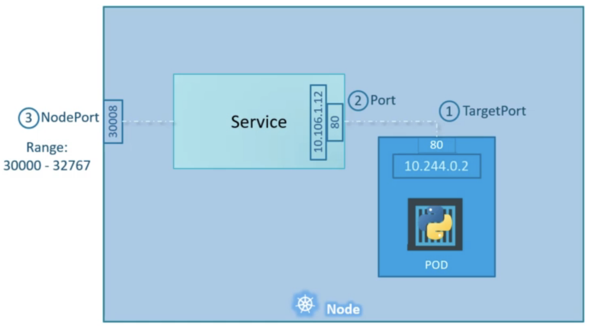

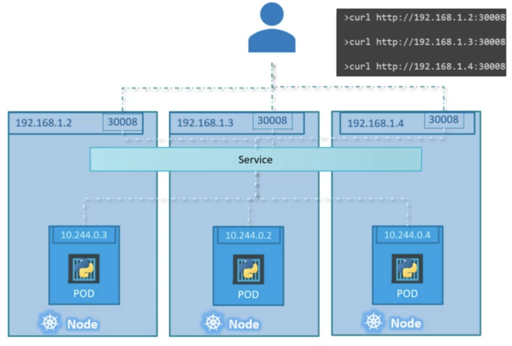


## ClusterIP

- creates a virtual IP inside the cluster from a set of frontend servers to a set of backend servers
- default type
```
apiVersion: vl
kind: Service
metadata:
  name: back-end
spec:
  type: ClusterIP
  ports:
  - targetPort: 80
    port: 80
  selector:
    app: myapp
    type: back-end
```


## LoadBalancer
Uses a cloud provider load balancer

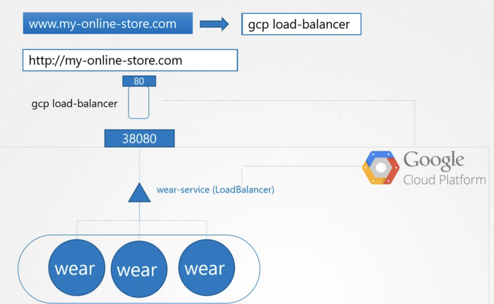


# Ingress

- like a layer 7 k8s load balancer
- ingress controller needs to be connected to a service of NodePort so that it can be exposed to the outside world with an IP and port
- requires
	- ServiceAccount for monitoring the state of k8s
	- service of type NodePort for being exposed to the internet
	- Role and RoleBinding for the SA
	- config map for configurations

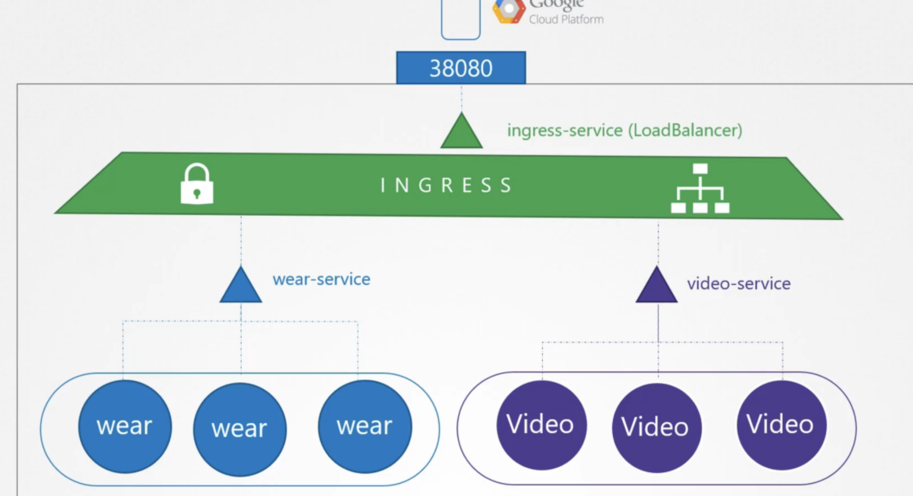

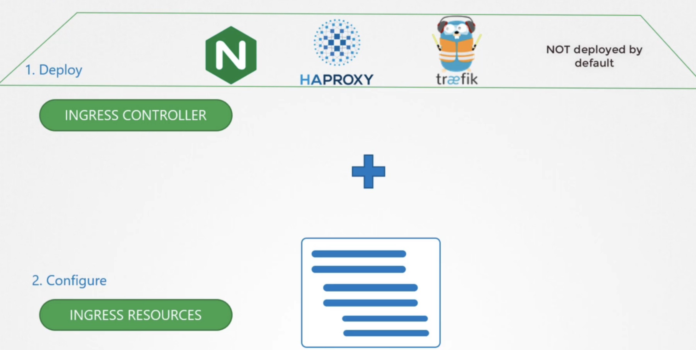


```
apiVersion: apps/v1
kind: Deployment
metadata:
  name: nginx-ingress-controller
spec:
  replicas: 1
  selector:
    matchLabels:
      name : nginx-ingress
  template:
    metadata:
      labels:
        name: nginx-ingress
  spec:
    containers:
    - name: nginx-ingress-controller 
      image: quay.io/kubernetes-ingress-controller/nginx-ingress-controller:0.21.0
      args:
      - /nginx-ingress-controller
      - --configmap=$ (POD NAMESPACE)/nginx-configuration # need to create this config map to contain the nginx configs
  env:
  - name: POD NAME
    valueFrom:
      fieldRef:
        fieldPath: metadata.name
  - name: POD NAMESPACE
    valueFrom:
      fieldRef:
        fieldPath: metadata.namespace
  ports:
  - name http
    containerPort: 80
    name: https
    containerPort: 443
```
Requires a NodePort svc
```
apiVersion: v1
kind: Service
metadata:
  name: nginx-ingress
spec:
  type: Node Port
  ports:
  - port: 80
    targetPort: 80
    protocol: TCP
    name: http
  - port: 443
    targetPort: 443
    protocol: TCP
    name: https
  selector:
    name: nginx-ingress
```

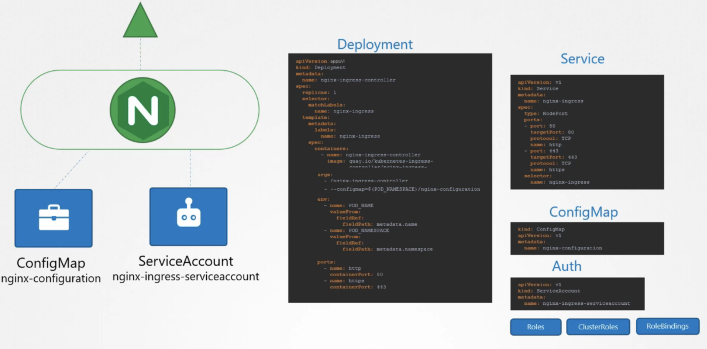


## Ingress Resource
- route based on prefix
- route based on path

Basic
```
apiVersion: extensions/vlbetal
kind: Ingress
metadata:
  name: ingress-wear
spec:
  backend:
    serviceName: wear-service
    servicePort: 80
```
Rules

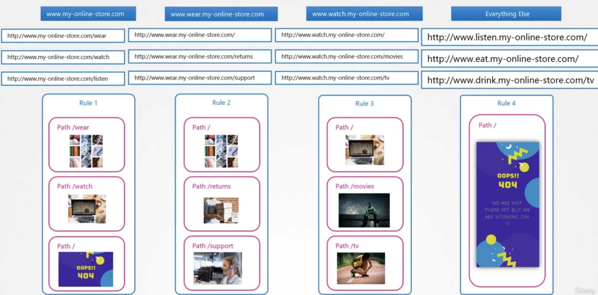


Route based on path

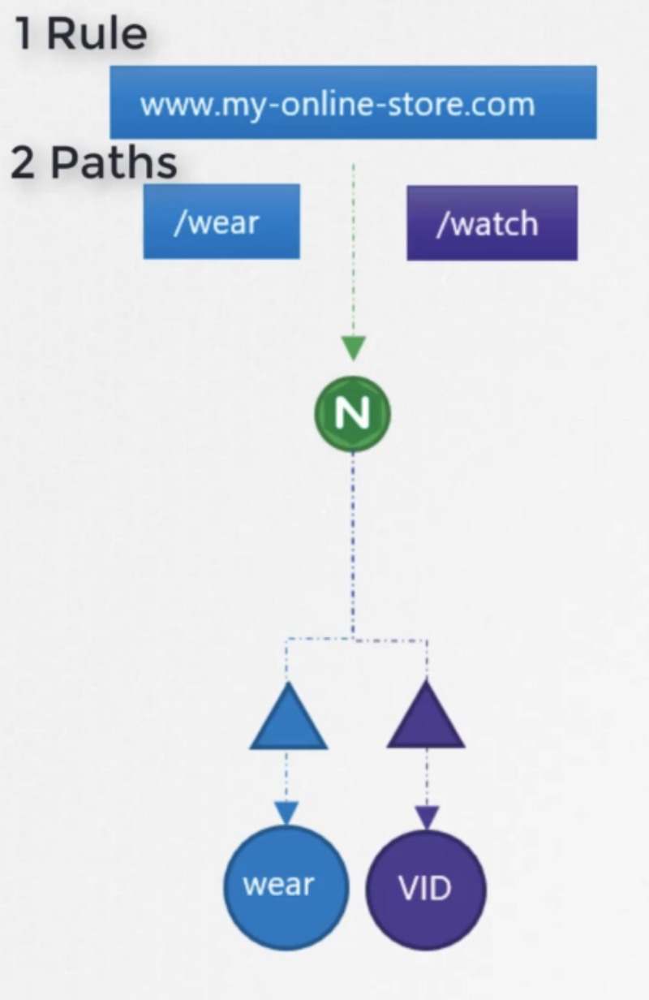


```
apiVersion: extensions/vlbetal
kind: Ingress
metadata:
  name: ingress-wear-watch
spec:
  rules:
  - http:
    paths:
    - path: /wear
      backend:
        serviceName: wear-service
        servicePort: 80
    - path: /watch
      backend:
        serviceName: watch-service
        servicePort: 80
```

Route based on hostname

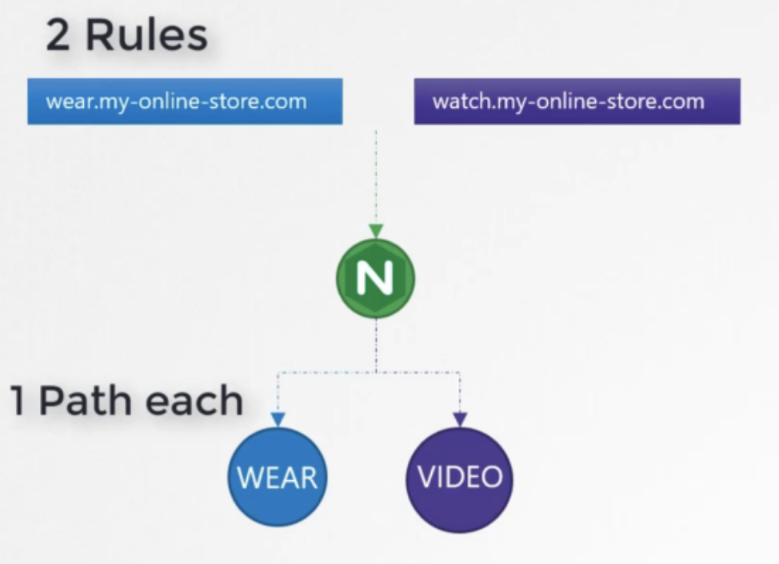


```
apiVersion: extensions/vibetal
kind: Ingress
metadata:
  name: ingress-wear-watch
spec:
  rules:
  - host: wear.my-online-store.com
    http:
      paths:
      - backend:
          serviceName: wear-service
          service Port: 80
  - host: watch.my-online-store.com
    http:
      paths:
      - backend:
          serviceName: watch-service
          servicePort: 80
```

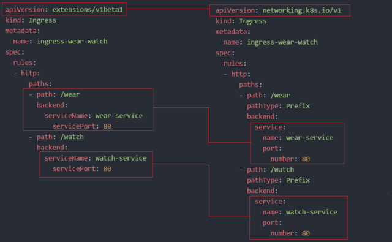


Path Types
- Exact
- Prefix
```
kubectl create ingress <ingress-name> --rule="host/path=service:port"

kubectl create ingress ingress-test --rule="wear.my-online-store.com/wear*=wear-service:80"
```

Target rewriting so that it removes /path from the url for the service
```
nginx.ingress.kubernetes.io/rewrite-target: /
```


# Traffic

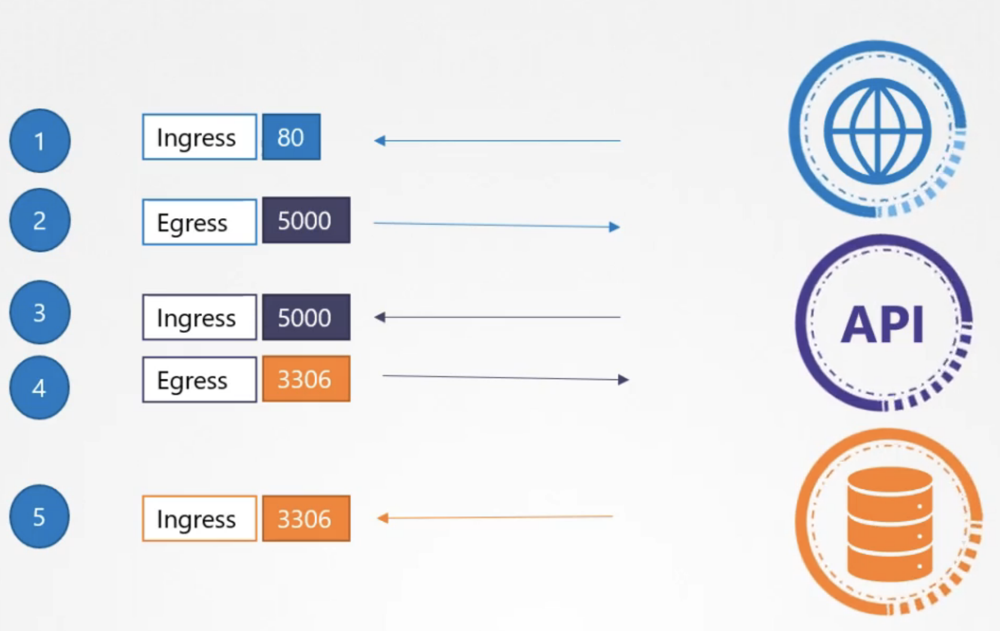


- default K8s allows all traffic on all ports


# Network Policy

```
apiVersion: networking.k8s.io/v1
kind: NetworkPolicy
metadata:
  name db-policy
spec:
  podSelector:
    matchLabels:
      role: db # apply this policy on pods with this label
  policylypes:
  - Ingress
  ingress:
  - from:
    - podSelector:
        matchLabels:
          name: api-pod # which pods to allow ingress from
    ports:
    - protocol: TCP
      port: 3306
```
- Network policies are enforced by the network solution like kube-router, calico
- responses are allowed automatically

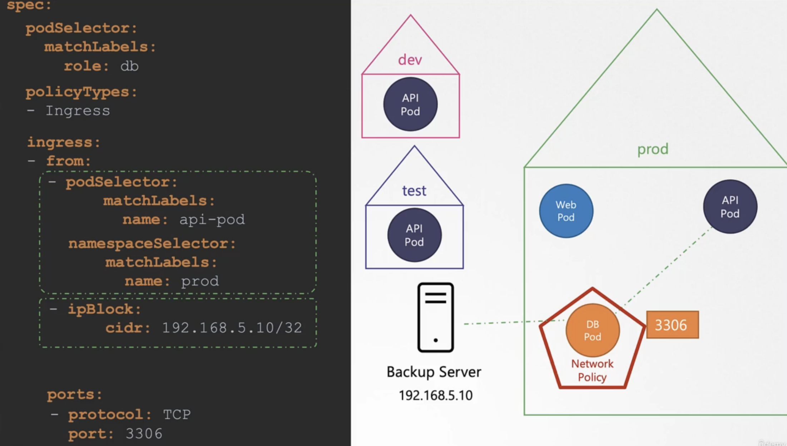


- elements in from are ORed
- properties within an element in from are ANDed
- (pod selector and namespace selector) or ipBlock

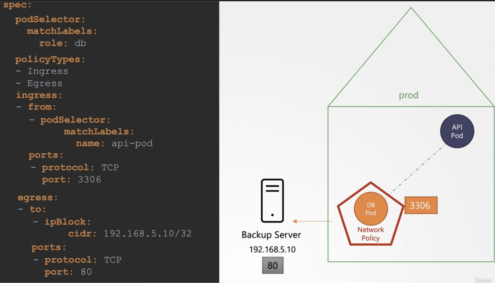


```
apiVersion: networking.k8s.io/v1
kind: NetworkPolicy
metadata:
  name: internal-policy
  namespace: default
spec:
  podSelector:
    matchLabels:
      name: internal
  policyTypes:
  - Egress
  - Ingress
  ingress:
    - {}
  egress:
  - to:
    - podSelector:
        matchLabels:
          name: mysql
    ports:
    - protocol: TCP
      port: 3306

  - to:
    - podSelector:
        matchLabels:
          name: payroll
    ports:
    - protocol: TCP
      port: 8080

  - ports:
    - port: 53
      protocol: UDP
    - port: 53
      protocol: TCP
```
- ports 53 tcp and udp required for kube-dns service 


