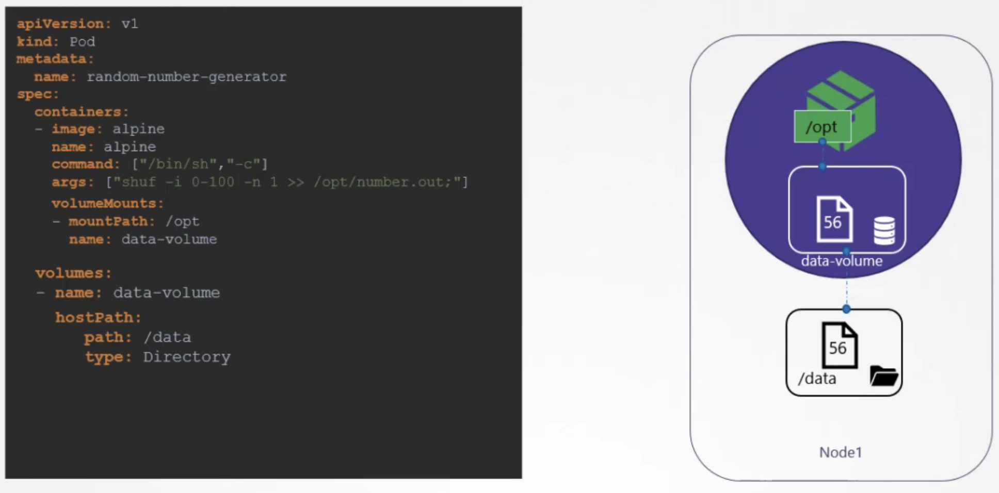
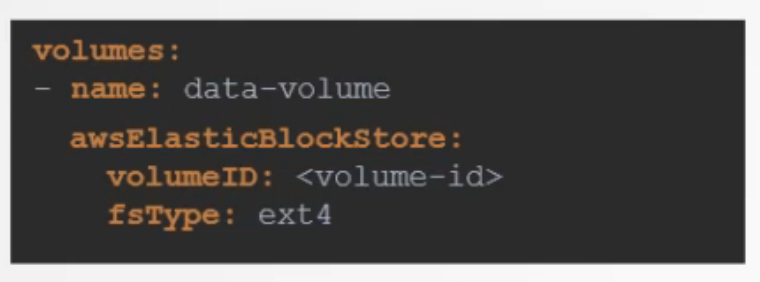

# Volumes




- configuration of the volumes in the pod definition
- easier to use pv
- volume mounted on directory on the node - hostPath
- data volume only as long as the pod is running - emptyDir

## EmptyDir

- An emptyDir volume is first created when a Pod is assigned to a node, and exists as long as that Pod is running on that node. As the name says, the emptyDir volume is initially empty. All containers in the Pod can read and write the same files in the emptyDir volume
- When a Pod is removed from a node for any reason, the data in the emptyDir is deleted permanently.
- safe during crashes of the pod

## HostPath

- A hostPath volume mounts a file or directory from the host node's filesystem into your Pod
- Directory, DirectoryOrCreate, File, FileOrCreate

## Persistent Volumes

- cluster wide pool of storage volumes to be used by the pods
- selecting a volume from this pool is done with a PVC
- persistentVolumeReclaimPolicy:
	- Retain
	- Delete
	- Recycle - data is scrubbed before being made available

```
apiVersion: v1
kind: Persistent Volume
metadata:
  name: pv-voll
spec:
  accessModes:
  - ReadWriteOnce
  capacity:
    storage: 1Gi
  awsElasticBlockstore:
    volumeID: ‹volume-id>
    fsType: ext 4
```

## Persistent Volume Claims

- make the storage available to the node
- a binding is created based on the request and the available PVs
- binding 1 to 1
- if the claim matches to more than one PV you can use labels and selectors to specify which one to use
- a smaller claim might be bound to a large PV if no other ones are available
- if no volumes are available the PVC will remain in a pending state
- checks for sufficient capacity, volume modes, access modes, storage class, selector before selecting
- the pv and pvc need to match on all above to be matched to each other
- retain policy means if the pvc is deleted, the pv is not deleted but is also not made available
- pvc stuck in terminating state = a pod is still mounted to it
```
apiVersion: vl
kind: Persistent VolumeClaim
metadata:
  name: myclaim
spec:
  accessModes:
  - ReadWriteOnce
  resources:
    requests:
      storage: 500Mi
```

Use
```
apiVersion: v1
kind: Pod
metadata:
  name: mypod
spec:
  containers:
    - name: myfrontend
      image: nginx
      volumeMounts:
      - mountPath: "/var/www/html"
        name: mypd
  volumes:
    - name: mypd
      persistentVolumeClaim:
        claimName: myclaim
```

This is static provisioning of PVs. You need to create the volume first on the cloud provider and then create the PV before you can use it by a PVC.


## Storage Classes

- dynamic provisioning
```
apiVersion: storage.k8s.io/vl
kind: StorageClass
metadata:
  name: google-storage
provisioner: kubernetes.io/gce-pd
parameters:
  type: pd-standard
  replication-type: none
```

In PVC specify storageClassName so that it knows which one to use
```
apiVersion: v1
kind: PersistentVolumeClaim
metadata:
  name: myclaim
spec:
  accessModes:
  - ReadWriteOnce
  storageClassName: google-storage
  resources:
    requests:
      storage: 500Mi
```

- The Storage Class still creates a PV in response to the PVC
- WaitForFirstConsumer - the PVC will remain in Pending state until a pod binds to the PVC
- Immediate - the PVC goes into Bound state immediately


